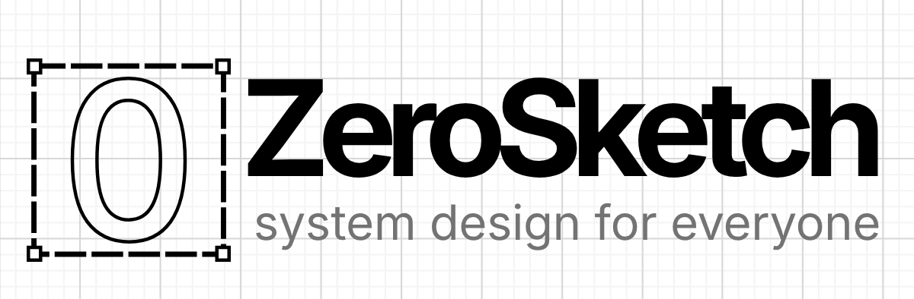

# ZeroSketch

A browser-based diagramming tool for creating system design diagrams and architecture sketches. It is built around a canvas with a focus on simplicity and ease of use.


## What it offers

**Available now**

- Drag & Drop Canvas
- Icon Libraries
- Custom Library Builder
- Free SVG & PNG Exports
- Local Persistent Storage

**Roadmap**

- Realtime Collaboration
- Cloud Sync
- AI Assisted Drawings
- DSL Exports (mermaid, etc.)
- Continuous Documentation Sync

## Tech stack

It mainly uses react, xyflow, zustand, kumo-ui, and tanstack start.

It uses pnpm for a monorepo set up, where:

- apps
  - marketing: landing page for zerosketch
  - web: the main app, which hosts the canvas and the libraries management page
- packages
  - canvas: canvas component and all canvas logic
  - models: library registry logic, data models, and types
  - common: shared themes, utils, etc.

## Development

**prerequisites:** node js, pnpm 11

```sh
pnpm install
```

**to run the canvas app locally**

```sh
pnpm --filter web dev
```

**lint**

```sh
pnpm lint
```

**format**

```sh
pnpm format
```

**tests**

```sh
pnpm test
```

## Contributing

Contributions are welcome. If you run into something unexpected or have a fix in mind, feel free to open an issue or a PR.

---

Special thanks to these awesome projects:

- xyflow
- dompurify
- html-to-image
- tanstack